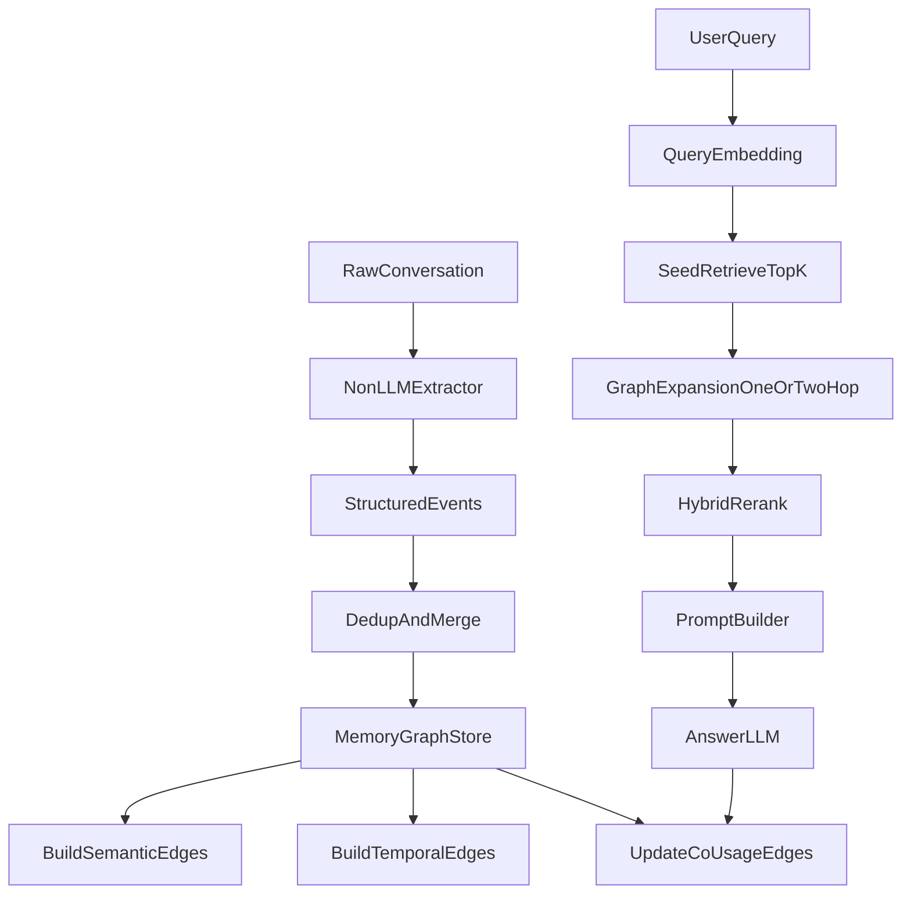

# Graph Memory Implementation Plan

## 1. Architecture overview

## 2. Data model
### 2.1 Node
- `node_id`
- `memory_text_struct` (structured text)
- `embedding`
- `topic` / `domain`
- `event_type`
- `time_index`
- `source_turn_ids`
- `version_info`
- `status_flags` (active / conflicted / merged)

### 2.2 Edge
- `edge_id`
- `src_node_id`
- `dst_node_id`
- `edge_type` in `{semantic, temporal, co_usage}`
- `weight`
- `created_at`
- `updated_at`
- `evidence_meta`

## 3. Add pipeline
1. conversation → non-LLM extractor → structured event records.  
2. Compute record embedding; nearest-neighbor against existing nodes.  
3. If `sim >= merge_threshold`:  
   - Merge into target node; write version trail;  
   - On temporal or semantic conflict, set conflict flag and keep snapshot of old values.  
4. If `sim < merge_threshold`:  
   - Create new node.  
5. Update edges:  
   - semantic: bidirectional links to top-k similar nodes;  
   - temporal: forward edges by `time_index`;  
   - co-usage: updated only at retrieval time.

### 3.1 Similar-but-temporally-conflicting protocol (v0.1)
Goal: avoid “high similarity always overwrites” losing historical preferences or scrambling temporal semantics.

#### Conflict classes
- `compatible`: semantically close and temporally coexistent (detail supplement, same-phase reinforcement).  
- `revision`: semantically close but expresses “new state replaces old”.  
- `context_split`: semantically close but different applicability (e.g. weekday/weekend, short/long term).  
- `hard_conflict`: semantically close and mutually exclusive with no clear conditioning dimension.

#### Write decisions
- `compatible`: allow merge; bump version and evidence span.  
- `revision`: do not overwrite old node; create new version node with `supersedes` and `temporal(old→new)`.  
- `context_split`: create parallel node with `condition_tag`; keep semantic edges within cluster.  
- `hard_conflict`: new node with conflict group; old node downweighted to `inactive/superseded`, not deleted.

#### Minimal node state fields
- `valid_from`, `valid_to`  
- `state` in `{active, inactive, superseded, conflicted}`  
- `supersedes` (optional)  
- `condition_tag` (optional)

#### Retrieval-side conflict handling
- Default: prefer `active + recent + temporal_fit`.  
- When the query implies “history / why it changed”, allow `superseded` nodes into reranking.  
- Penalize `inactive` nodes multiplicatively; no hard deletes—keep traceability.

## 4. Search pipeline
1. Query embedding retrieves seed nodes (top-k).  
2. Graph expansion:  
   - bounded neighbors per semantic/temporal/co-usage edge;  
   - default 1 hop; 2 hops for harder queries.  
3. Fused rerank (centrality prior path chosen):  
   - `score = alpha * semantic + beta * centrality + gamma * edgeEvidence + delta * temporalFit`  
4. Pick top-n evidence; build memory prompt.  
5. After answering, update co-usage edges (pairs co-hit in one query with no prior edge).

## 5. Core / residual layering
- Compute `core_score` from PageRank + in-degree + usage frequency.  
- `core_score >= tau_core` → core; else residual.  
- Rerank with `core_prior`:  
  - `score_final = score * (1 + lambda_core)` for core  
  - no boost for residual  
- Initial suggestion: small grid on `lambda_core` (e.g. 0.1 / 0.2 / 0.3).

## 6. Extractor design (non-LLM)
### Candidates
- Rule templates: high control, low cost, fast to ship.  
- Lightweight models: better generalization but need labels/training.  
- Hybrid: rule backbone + small model fallback.

### Recommended default
- Hybrid:  
  - Rules extract core slots (`event_type` / `topic` / `preference` / `update` / `time`).  
  - Lightweight classifier for ambiguous cases (can be deferred; not blocking MVP).

## 7. Benchmark order (current)
1. `LoCoMo`: primary benchmark (very long multi-session dialogue memory; matches this system).  
2. `PERMA`: baseline and ablation regression (preference/event QA with task-aligned context).  
3. `PersonaMem`: migration validation after the pipeline is stable.

## 8. Ablation design
- Edge ablations:  
  - semantic only  
  - semantic + temporal  
  - semantic + co-usage  
  - full graph  
- Layering ablations:  
  - no core prior  
  - static core prior  
  - centrality core prior (main path)  
- Write ablations:  
  - merge on/off  
  - temporal conflict policy A/B  

## 8.1 Regression testing strategy
- `unit/smoke`: no online LLM; validates Add/Search basics.  
- `mini e2e`: online LLM; small real PERMA sample (`limit=2/5`) graph vs semantic.  
- `expanded e2e`: multi-user / larger `limit` for stability claims.  
- Rule: after changes to extractor, merge rules, or rerank formula, run at least mini e2e before large-sample runs.

## 9. Open questions (to finalize later)
- Merge conflict strategy:  
  - overwrite (latest-wins)  
  - coexist (multi-version)  
  - relational conflict nodes (recommended mid-term)  
- Co-usage noise:  
  - minimum co-occurrence threshold  
  - edge decay and expiry  

## 10. Known weaknesses and priorities
### P0 (must fix first)
- Loose write conflict rules → persona drift and wrong overwrites.  
- Unstable extractor granularity → poor nodes (graph structure cannot compensate).  
- Unconstrained fusion weights → “tuning lottery” in conclusions.

### P1 (fix soon)
- Co-usage edges may densify quickly → spurious associations.  
- Strong core prior → hub monopoly, suppressing recent critical facts.  
- If `topic/domain` schema diverges, cross-benchmark migration suffers.

### P2 (mid-term)
- Cost of graph updates vs batch centrality refresh.  
- Balance expansion depth vs latency on long sessions (adaptive hop).  
- Extractor robustness under noisy registers (especially PERMA noise settings).

## 11. Default parameter seeds (v0.1)
Starting points for MVP; tune on PERMA dev split via grid search and ablations.

### 11.1 Add parameters
- `merge_threshold = 0.88` (merge only at high similarity)  
- `semantic_edge_threshold = 0.78` (minimum sim for semantic edges)  
- `semantic_edge_topk = 8` (max semantic neighbors per new node)  
- `temporal_link_window = 20` (lookback window for temporal edges, in recent nodes)

### 11.2 Search parameters
- `seed_topk = 12` (semantic seeds)  
- `expand_hop = 1` (default 1; 2 for harder queries)  
- `expand_max_neighbors_per_type = 6` (per edge type)  
- `final_topn_evidence = 8` (evidence lines in prompt)

### 11.3 Fusion weights
- `alpha_semantic = 0.60`  
- `beta_centrality = 0.20`  
- `gamma_edge_evidence = 0.15`  
- `delta_temporal_fit = 0.05`  
- `lambda_core = 0.20` (core prior multiplier coefficient)

Notes:  
- Keep `alpha` dominant early to avoid centrality taking over retrieval too soon.  
- Search `lambda_core` roughly in `0.10 / 0.20 / 0.30`; **no-prior baseline** uses `λ=0` (`PermaEvalConfig.lambda_core=0` or `train/perma/tune_lambda_core.py --lambdas 0,0.1,0.2,0.3`).

### 11.4 Co-usage edge controls (implemented)
- **Solidify**: `co_usage_min_count` (default `1`: edge on first joint hit; `2` waits for second).  
- **Expand**: `expand_min_co_usage_usage` ignores weak edges when traversing co-usage.  
- **Decay**: optional `co_usage_decay`, `co_usage_prune_threshold` per retrieval round (`MemoryGraphStore.decay_co_usage_edges`).

### 11.5 State / conflict parameters
- `inactive_penalty = 0.35` (multiplicative penalty on inactive nodes in rerank)  
- `history_query_boost = 0.20` (boost for superseded nodes on history/change queries)  
- `conflict_group_max_active = 1` (one active primary version per conflict group by default)
