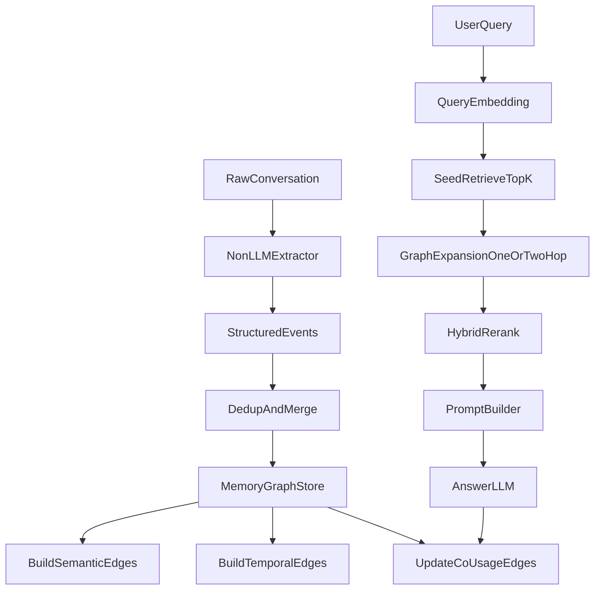

# Graph Memory Implementation Plan

## 1. 架构总览

## 2. 数据模型
### 2.1 Node
- `node_id`
- `memory_text_struct`（结构化文本）
- `embedding`
- `topic/domain`
- `event_type`
- `time_index`
- `source_turn_ids`
- `version_info`
- `status_flags`（active/conflicted/merged）

### 2.2 Edge
- `edge_id`
- `src_node_id`
- `dst_node_id`
- `edge_type` in `{semantic, temporal, co_usage}`
- `weight`
- `created_at`
- `updated_at`
- `evidence_meta`

## 3. 写入流程（Add）
1. conversation -> 非LLM extractor -> 结构化 event records。
2. 计算 record embedding，与现有 node 执行近邻检索。
3. 若 `sim >= merge_threshold`：
   - merge 到目标 node，写入版本轨迹；
   - 若时间或语义冲突，打 conflict flag，保留旧值快照。
4. 若 `sim < merge_threshold`：
   - 创建新 node。
5. 更新边：
   - semantic：对 top-k 高相似节点双向连边；
   - temporal：按 time_index 建前向边；
   - co-usage：仅在检索阶段触发更新。

### 3.1 相似但时间冲突的处理协议（v0.1）
目标：避免“高相似即覆盖”导致历史偏好丢失或时间语义错乱。

#### 冲突分类
- `compatible`：语义相近且时间可并存（补充细节、同阶段强化）。
- `revision`：语义相近但表达“新状态替代旧状态”。
- `context_split`：语义相近但适用条件不同（如工作日/周末、短期/长期）。
- `hard_conflict`：语义相近且互斥，且无清晰条件可拆分。

#### 写入决策
- `compatible`：允许 merge，更新 node 版本号与证据跨度。
- `revision`：不覆盖旧节点；创建新版本节点，连 `supersedes` 与 `temporal(old->new)`。
- `context_split`：新建平行节点，写入 `condition_tag`，与同簇节点保留 semantic 边。
- `hard_conflict`：新建节点并标记冲突组；旧节点降权为 `inactive/superseded`，但不删除。

#### 节点状态字段（最小集）
- `valid_from`, `valid_to`
- `state` in `{active, inactive, superseded, conflicted}`
- `supersedes`（可为空）
- `condition_tag`（可为空）

#### 检索侧冲突解算
- 默认优先：`active + recent + temporal_fit`。
- 当 query 带“历史/变化原因”意图时，放开 `superseded` 节点参与重排。
- 对 `inactive` 节点施加惩罚，不做硬删除，保留可追溯性。

## 4. 检索流程（Search）
1. query embedding 召回 seed nodes（top-k）。
2. 图扩展：
   - semantic/temporal/co-usage 边各取限定邻居；
   - hop 默认 1，复杂 query 可升到 2。
3. 融合重排（你已选择中心性先验路线）：
   - `score = alpha * semantic + beta * centrality + gamma * edgeEvidence + delta * temporalFit`
4. 选择 top-n evidence，构建 memory prompt。
5. 回答后更新 co-usage edges（仅对同次命中且原无边的节点建边）。

## 5. Core/Residual 分层
- 依据 PageRank + 入度 + 使用频次计算 `core_score`。
- `core_score >= tau_core` 归为 core，其余 residual。
- 在 rerank 时引入 `core_prior`：
  - `score_final = score * (1 + lambda_core)` for core
  - residual 不加成。
- 初版建议：`lambda_core` 小范围网格搜索（如 0.1 / 0.2 / 0.3）。

## 6. Extractor 方案决策（非 LLM）
## 候选方案
- 规则模板：高可控、低成本、启动快。
- 轻量模型：泛化更强，但需标注/训练。
- 混合方案：规则主干 + 小模型兜底。

## 推荐默认
- 采用混合方案：
  - 规则先抽取核心槽位（event_type/topic/preference/update/time）。
  - 轻量分类器用于歧义样本仲裁（可后置，不阻塞MVP）。

## 7. Benchmark 执行顺序
1. `PERMA`：主 benchmark，先完成设计验证。
2. `PersonaMem`：全流程完成后做迁移验证。
3. `LoCoMo`：可选压力测试（时序/因果与超长上下文）。

## 8. 消融实验设计
- Edge 消融：
  - semantic only
  - semantic + temporal
  - semantic + co-usage
  - full graph
- 分层消融：
  - no core prior
  - static core prior
  - centrality core prior（主方案）
- 写入策略消融：
  - merge on/off
  - temporal conflict policy A/B

## 8.1 回归测试策略（新增）
- `unit/smoke`：不依赖在线 LLM，验证 Add/Search 基本流程稳定。
- `mini e2e`：依赖在线 LLM，使用真实 PERMA 小样本（如 `limit=2/5`）做 graph-vs-semantic 对照。
- `expanded e2e`：多用户/更大样本（如 `limit>=50`）用于稳定性结论。
- 原则：每次修改 extractor、merge 规则、rerank 公式后，至少先跑 mini e2e 再跑扩样本。

## 9. 开放问题（需后续定稿）
- merge 冲突策略：
  - 覆盖（latest-wins）
  - 并存（multi-version）
  - 关系化冲突节点（推荐中期探索）
- co-usage 污染控制：
  - 最小共现次数门槛
  - 边权衰减与过期机制

## 10. 当前方案的缺陷与改进优先级
### P0（必须先解决）
- 写入冲突策略如果不严格，会导致 persona 状态漂移和错误覆盖。
- extractor 粒度不稳定会直接劣化 node 质量（后续图结构再好也无效）。
- 检索融合参数若无约束，实验结论容易“调参偶然性”过高。

### P1（应尽快解决）
- co-usage 边可能快速稠密化，带来误联想传播。
- core prior 过强会让中心节点垄断，压制新近关键信息。
- topic/domain schema 若不统一，跨 benchmark 迁移会失真。

### P2（中期优化）
- 图更新与中心性重算开销控制（在线 vs 批处理）。
- 长会话下图扩展深度与延迟的平衡（hop 自适应）。
- 多语体/噪声表达下 extractor 鲁棒性（尤其 PERMA 噪声设置）。

## 11. 默认参数初始值（v0.1）
以下参数用于 MVP 起步，后续通过 PERMA dev split 做网格搜索与消融。

### 11.1 写入参数（Add）
- `merge_threshold = 0.88`（高相似才触发 merge）
- `semantic_edge_threshold = 0.78`（构建 semantic 边的下限）
- `semantic_edge_topk = 8`（每个新节点最多连接的语义邻居数）
- `temporal_link_window = 20`（构建 temporal 边时回看窗口，单位：最近节点数）

### 11.2 检索参数（Search）
- `seed_topk = 12`（query 语义召回种子节点数）
- `expand_hop = 1`（默认 1-hop，复杂 query 可升 2）
- `expand_max_neighbors_per_type = 6`（每类边扩展上限）
- `final_topn_evidence = 8`（进入 prompt 的最终证据条数）

### 11.3 融合打分参数
- `alpha_semantic = 0.60`
- `beta_centrality = 0.20`
- `gamma_edge_evidence = 0.15`
- `delta_temporal_fit = 0.05`
- `lambda_core = 0.20`（core prior 加权系数）

说明：
- 初期保持 `alpha` 主导，避免中心性过早垄断检索。
- `lambda_core` 建议只在 `0.10 / 0.20 / 0.30` 范围内搜索。

### 11.4 co-usage 边控制
- `co_usage_min_count = 2`（至少共现2次才固化）
- `co_usage_decay = 0.98`（每轮查询后做边权衰减）
- `co_usage_prune_threshold = 0.05`（低于阈值的弱边清理）

### 11.5 状态/冲突参数
- `inactive_penalty = 0.35`（inactive 节点在重排时乘性惩罚）
- `history_query_boost = 0.20`（历史/变更类 query 对 superseded 节点的补偿）
- `conflict_group_max_active = 1`（同冲突组默认仅允许一个 active 主版本）
