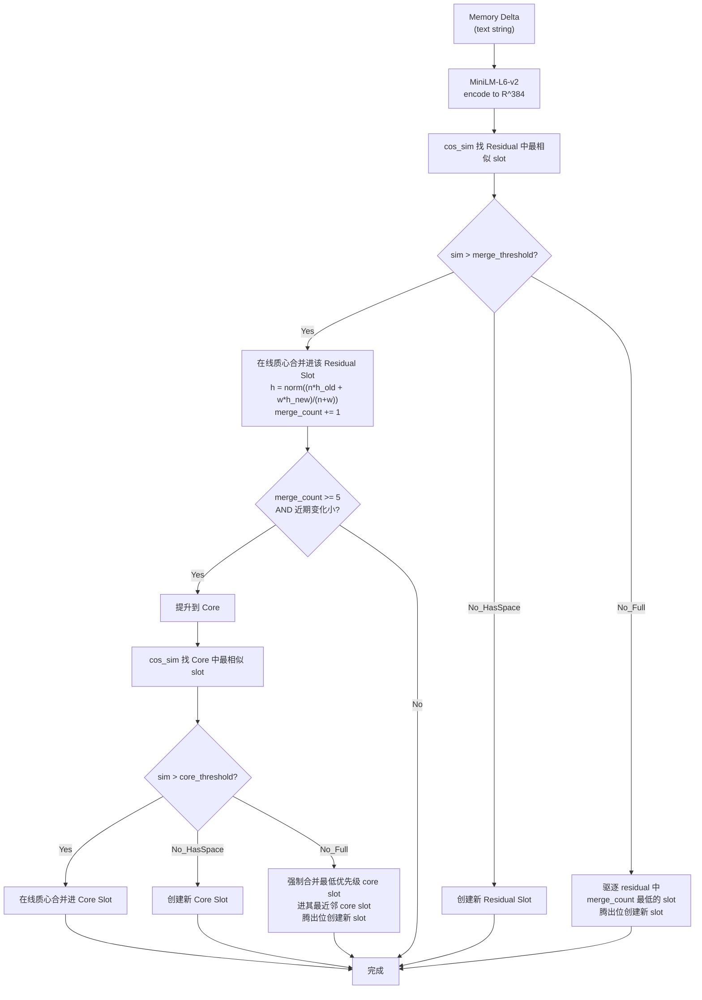

# CoRe Memory Write Path 实现计划

## 设计总结

### Slot 数据结构（Core 和 Residual 共用）

每个 slot 存储：

```python
@dataclass
class MemorySlot:
    embedding: np.ndarray     # R^384, L2-normalized
    merge_count: int          # 被合并过多少次
    timestamp: float          # 最后更新时间
    salience: float           # 重要性分数
    provenance: str           # session/turn id
    stable: bool              # 是否收敛（用于 promotion 判断）
```

不存储 text shadow（后续用 vec2text 解码）。

### 数据流



### 关键参数（写入 `configs/default.toml`）

- `residual_slots = 64`
- `core_slots = 32`
- `embedding_model = "sentence-transformers/all-MiniLM-L6-v2"`
- `embedding_dim = 384`
- `merge_threshold = 0.5` (cos_sim 低于此值视为"新信息")
- `core_threshold = 0.5`
- `promotion_merge_count = 5`
- `stability_window = 3` (最近 3 次合并)
- `stability_epsilon = 0.05` (变化量阈值)
- `recency_weight = 1.5` (在线质心中新信息的 recency boost)

### 合并公式：在线质心 (Online Centroid / Running Mean)

Residual 和 Core 共用同一公式，通过 recency_weight 可选地给新信息略高权重：

```python
n = slot.merge_count
h = normalize((n * h_old + recency_weight * h_new) / (n + recency_weight))
slot.merge_count += 1
```

特性：
- 无需调 learning rate，merge_count 自然控制新信息影响力
- slot 收敛到所有历史 delta 的质心，对 vec2text 解码友好
- recency_weight > 1 时，新信息影响略大于历史平均，防止老 slot 僵化

### Residual 驱逐策略

Residual 满了且新 delta 不匹配任何 slot 时：驱逐 merge_count 最低的 slot（信息最稀薄），腾出位置给新 slot。

### Core 驱逐策略

Core 满了且新 slot 无相似匹配时：找 merge_count 最低的 core slot，强制合并进其 cos_sim 最近的 core slot，腾出位置给新 slot。

### 持久化

使用 safetensors 存储 embeddings + JSON 存储 metadata，支持跨 session 的 save/load。

### Embedding 模型加载

全局单例模式，加载一次后复用。

### Stability 判断

- `stability_window = 3`：检查最近 3 次合并的 `||h_new - h_old||`
- `stability_epsilon = 0.05`：变化量阈值
- 配合 `promotion_merge_count = 5`，前 2 次合并允许波动，后 3 次检查收敛
- 如实验发现 promotion 太激进，优先调高 promotion_merge_count 而非加大 stability_window

## 修改文件清单

### 修改已有文件

- `src/core_mem/config.py`: 增加 `EmbeddingSettings` 和扩展 `MemorySettings`，添加所有新参数
- `src/core_mem/writer.py`: 实现 embedding 编码（加载 MiniLM）+ 入口方法
- `src/core_mem/residual_manager.py`: 实现 slot 存储、find_most_similar、merge、eviction、promotion 判断
- `src/core_mem/core_updater.py`: 实现 core slot 存储、merge、eviction（强制合并最近邻）
- `configs/default.toml`: 添加 embedding 和 merge 相关参数

### 新建文件

- `src/core_mem/slot.py`: `MemorySlot` 数据类 + cos_sim / online centroid merge 工具函数（Core 和 Residual 共用）
- `src/core_mem/embedding.py`: MiniLM-L6-v2 加载和 encode 封装（全局单例）

### 不动的文件

- `src/core_mem/reader.py`: 后续实现
- `src/core_mem/benchmarks/*`: 后续实现
- `src/core_mem/evaluation/*`: 后续实现

## 实现顺序

1. `slot.py` — MemorySlot dataclass + 工具函数
2. `embedding.py` — MiniLM 封装
3. `config.py` + `default.toml` — 参数扩展
4. `residual_manager.py` — residual 存储、合并、驱逐、promotion 判断
5. `core_updater.py` — core 存储、合并、强制合并驱逐
6. `writer.py` — 入口：接收 delta → encode → 写入 residual → 触发 promotion
7. Unit tests
